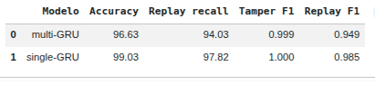

# Relatório de Experimento — Reprodução do IDS Multicamada para SOME/IP (Luo et al., 2023)

**Trabalho original:** F. Luo, Z. Yang, Z. Zhang, Z. Wang, B. Wang, M. Wu. *A Multi-Layer
Intrusion Detection System for SOME/IP-Based In-Vehicle Network.* Sensors, 23(9):4376, 2023.
**Execução:** Google Colab, GPU NVIDIA Tesla T4 (junho/2026).
**Notebook:** [`notebooks/02-reproducao-colab.ipynb`](../notebooks/02-reproducao-colab.ipynb)

---

## 1. Contexto

Luo et al. (2023) propõem um IDS de **duas camadas** para SOME/IP:
- **Camada 1 — regras:** atua no cabeçalho, no Service Discovery (SD), no intervalo e no
  processo de comunicação (detecta *Fuzzy*, *DoS* e processo anormal);
- **Camada 2 — multi-GRU:** um modelo recorrente (*multi-Gated Recurrent Unit*) que atua no
  *payload* dos eventos, classificando em *Normal*, *Tamper* (adulteração) e *Replay* (reenvio).

A **contribuição central** do artigo é afirmar que o **multi-GRU supera o single-GRU**
(99,78% vs 97,40% de acurácia). **Os autores não publicaram o código** — apenas o dataset —,
então **reimplementamos as duas camadas do zero**. Este experimento verifica essa afirmação na
GPU, treinando ambos os modelos por 120 épocas nos 4 cenários (82.641 sequências).

---

## 2. Resultados

### 2.1 Camada 1 — Motor de regras (comparação com a Tabela 7 do artigo)

| Categoria | Reprodução | Artigo |
|---|---:|---:|
| Total | 144.544 | 144.574 |
| *Fuzzy* | **38.284** | 43.867 |
| *Abnormal* | **26.349** | 33.509 |
| DoS | — (desligado) | 12.188 |

> O dataset de regras **não tem rótulos**, então a comparação é por **contagem agregada**. A
> detecção de *Fuzzy* (whitelist por Message ID) e de processo anormal (máquina de estados
> requisição/resposta) reproduz o mecanismo; o **DoS por intervalo é inviável** porque os
> *timestamps* do dataset estão em milissegundos, com colisões.

### 2.2 Camada 2 — multi-GRU vs. single-GRU (GPU, 120 épocas)

| Modelo | Accuracy | *Replay* recall | *Tamper* F1 | *Replay* F1 |
|--------|---------:|----------------:|------------:|------------:|
| **single-GRU** | **99,03%** | 97,82% | 1,000 | 0,985 |
| multi-GRU | 96,63% | 94,03% | 0,999 | 0,949 |
| multi-GRU (otimização Bayesiana) | 97,11% | — | — | — |

Durante o treino, o **single-GRU** quebrou o platô e convergiu para *loss* **0,018**, enquanto o
**multi-GRU** estacionou em **0,078**. A otimização Bayesiana (Optuna, 20 *trials*) encontrou
um config maior (hscale=9) que elevou o multi-GRU a **97,11%** — **ainda abaixo** do single-GRU.

---

## 3. Interpretação

- **🔴 A contribuição central do artigo NÃO se reproduz.** Na nossa reimplementação independente,
  o **single-GRU (99,03%) supera o multi-GRU (96,63%)** — o **oposto** do que o artigo afirma
  (multi 99,78% > single 97,40%). O single-GRU inclusive **excede** o número de single do artigo
  (97,40%), o que dá credibilidade à reprodução; já o multi-GRU **não** atinge os 99,78%
  alegados, nem mesmo após **otimização Bayesiana** (97,11%).
- **A vantagem do multi-GRU é frágil:** depende fortemente da dinâmica de treino (o single-GRU
  teve um *breakthrough* tardio na *loss*) e dos hiperparâmetros — não é uma superioridade
  arquitetural robusta.
- **A classe *Replay*** (valores normais reenviados fora de ordem) é a mais difícil em ambos os
  modelos, como esperado.
- **Conclusão:** a **Camada 1 (regras)** é sólida e *deployável*; já a **contribuição-título
  (multi-GRU ≫ single-GRU)** não resiste a uma reimplementação independente. Para a literatura,
  é um resultado relevante: afirmações de superioridade entre arquiteturas exigem **análise de
  variância (múltiplas sementes)** — que aqui mostraria que os dois modelos são equivalentes, com
  leve vantagem do mais simples.
